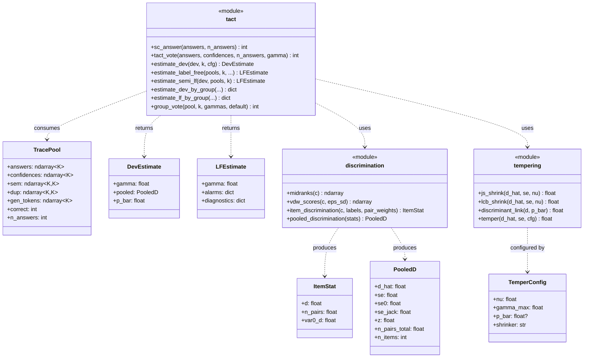
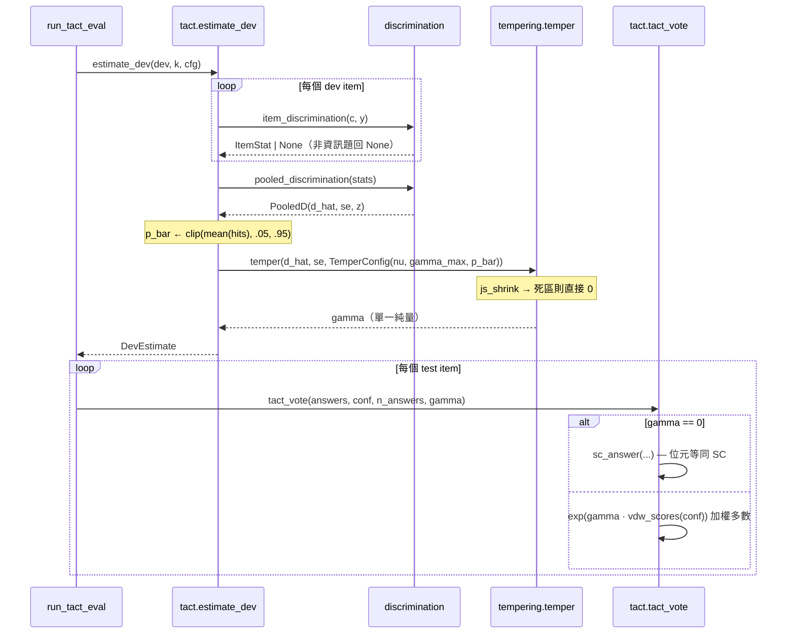
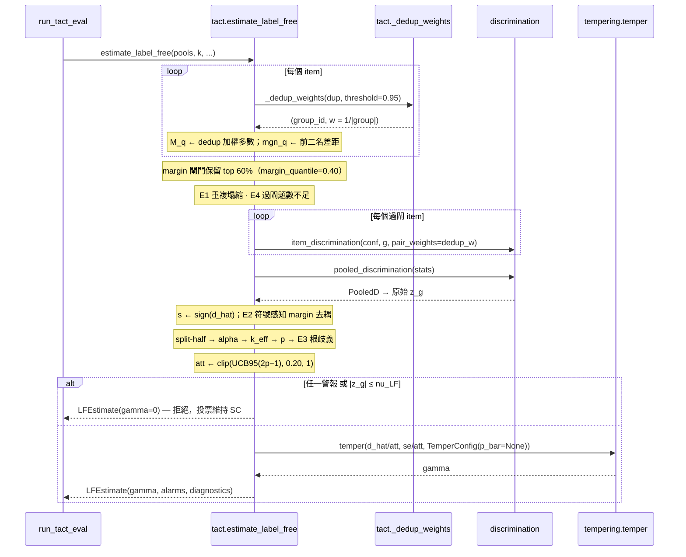

# TACT 架構：從偽碼到模組

論文 Algorithm 1（`paper/tact.tex`，`alg:tact`）與 Algorithm 2（`alg:tactlf`）的每一行都對應到一個實作位置。這份文件是那張對照表，外加型別與呼叫關係。**偽碼裡的每個符號名稱都與程式碼裡的識別字一致**，改動任一邊都應同步。

---

## 1. 型別與依賴

`formula.py` 是獨立的第二實作：`gamma_of()` 把收縮＋連結＋截斷寫成一條閉式，`tests/test_formula.py` 斷言它在含所有邊界的隨機輸入上與 `tempering.temper()` 等價。它存在的目的就是讓論文那條單一公式不只是敘述。

---

## 2. 有標籤路徑（Algorithm 1）

## 3. 無標籤路徑（Algorithm 2）

---

## 4. 偽碼 ↔ 程式碼對照（一致性驗證）

### Algorithm 1

| 行 | 偽碼 | 實作位置 |
|---:|---|---|
| 3 | $y_i\gets\mathbf{1}[a_{q,i}=a^\ast_q]$ | `tact.estimate_dev` |
| 4 | 只取有資訊題 | `item_discrimination` 回 `None`（`n1<=0 or n0<=0`） |
| 5 | 題內中位秩 | `discrimination.midranks` |
| 6 | $D_q=2U_q/(n^1_qn^0_q)-1$ | `item_discrimination`（`u`, `auc`, `d`） |
| 7 | $\mathrm{Var}_0(D_q)$ tie 校正 | `item_discrimination`（`tie_term`, `correction`, `var0_d`） |
| 8 | van Elteren 混合 | `pooled_discrimination`（`d_hat`） |
| 9 | $\mathrm{SE}=\max\{\cdot,\cdot,\cdot\}$ | `pooled_discrimination`（`se0`, `se_jack`, 地板） |
| 10 | $\bar p$ | `estimate_dev`（`np.clip(..., 0.05, 0.95)`） |
| 12–13 | 死區 | `tempering.js_shrink`（`a <= nu*se → 0.0`） |
| 15 | 正部 JS | `js_shrink` |
| 16–17 | 連結＋截斷 | `discriminant_link` + `temper` 的 `np.clip` |
| 20 | $\gamma=0$ 走 SC | `tact_vote` 的 `if gamma == 0.0: return sc_answer(...)` |
| 22 | vdW 分數 | `discrimination.vdw_scores` |
| 23 | 加權多數 | `tact_vote`（`np.bincount(..., weights=w)`） |

### Algorithm 2

| 行 | 偽碼 | 實作位置 |
|---:|---|---|
| 2 | 單鏈結去重權重 | `tact._dedup_weights`（union-find） |
| 3–4 | 去重加權多數／margin | `estimate_label_free` 的 per-item 迴圈 |
| 5 | margin 閘門 | `margin_quantile=0.40` → `cut`, `gated` |
| 6 | $E_1$ | `alarms["E1_duplicate_collapse"]` |
| 7 | $E_4$ | `alarms["E4_too_few_items"]`（`min_gated_items`） |
| 9 | 過閘題的合併統計量 | `pooled_discrimination(stats)` |
| 10–11 | 信任方向、$E_2$ | `trust_dir`, `psi`, `alarms["E2_margin_decoupling"]` |
| 12–14 | split-half → $\alpha,k,p$ | `agree`, `k_eff`, `solve_p` |
| 15 | $E_3$ | `alarms["E3_root_ambiguity"]`（`disc < 0.02`） |
| 16 | 去衰減上界 | `att_ucb`, `att`（`att_floor=0.20`） |
| 17–18 | 警報或不顯著 → 0 | `if any(alarms.values()) or abs(pooled.z) <= nu` |
| 19 | 調節，$\bar p$ 不設 | `temper(..., TemperConfig(p_bar=None))` |

---

## 5. 兩處與論文敘述不完全一致、但確為刻意的地方

1. **$\bar p$ 在兩條路徑不同。** 有標籤路徑用 dev 實測的 $\bar p$（`estimate_dev` 取 `mean(hits)` 並 clip 到 $[0.05,0.95]$）；無標籤路徑傳 `p_bar=None`，等於**不施加混合變異數校正**。論文正文以 $\bar p=1/2$ 作為呈現上的化簡（那時 $\gamma=z\sqrt{2+z^2}$），Algorithm 1 第 10 行才是實際行為。基礎率正是無標籤估計器不會知道的東西，所以這個不對稱是有理由的，Algorithm 2 第 19 行已明寫。

2. **`item_discrimination` 的成對權重只進 $N_q$，不進秩統計量本身。** 去重權重會影響 `n1/n0`（因而影響混合權重 $N_q$），但 Mann–Whitney 核仍用未加權的 `n1_raw/n0_raw`。加權核可行，但會弄髒精確零假設變異數，所以刻意不做——這一點寫在 `item_discrimination` 的 docstring 裡。

## 6. 已備妥的消融鉤子

`tempering.py` 已內建兩個可直接切換的替代分支，不必改程式碼：

- `TemperConfig(shrinker="lcb")` — 換成單側下界軟門檻（與 JS 同死區，對強訊號更保守）
- `TemperConfig(p_bar=None)` — 關掉混合變異數校正

無標籤路徑實際上就已經是 `p_bar=None` 的那一支。群組研究中 LF（0.923）與 dev（0.927）落在同一個 seed 雜訊區間內，所以「校正是否買到準確率」這個問題，現有資料已經給出一個弱的否定答案。
