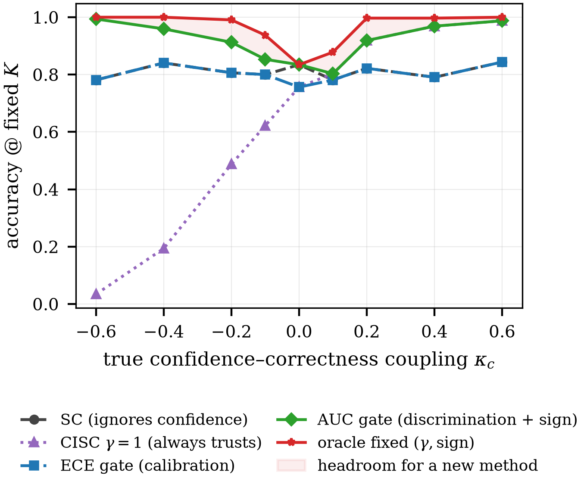
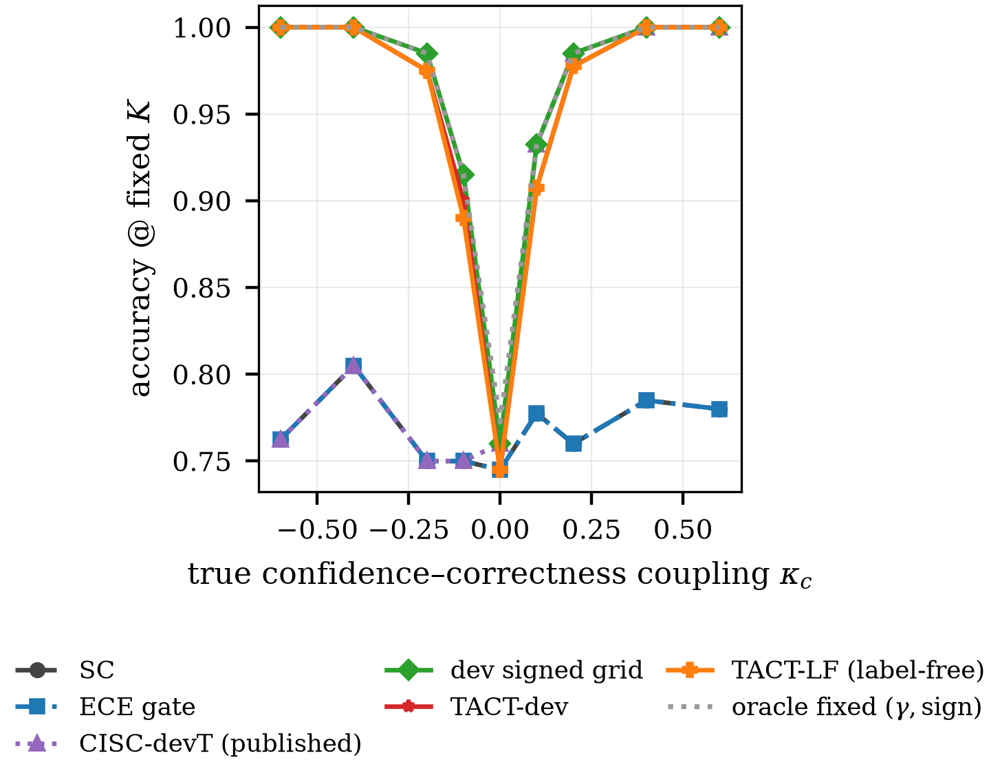
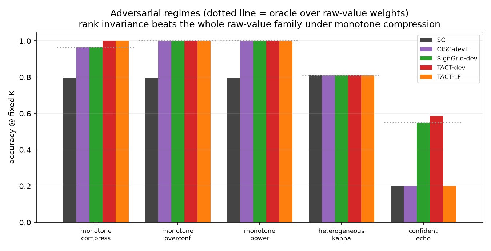
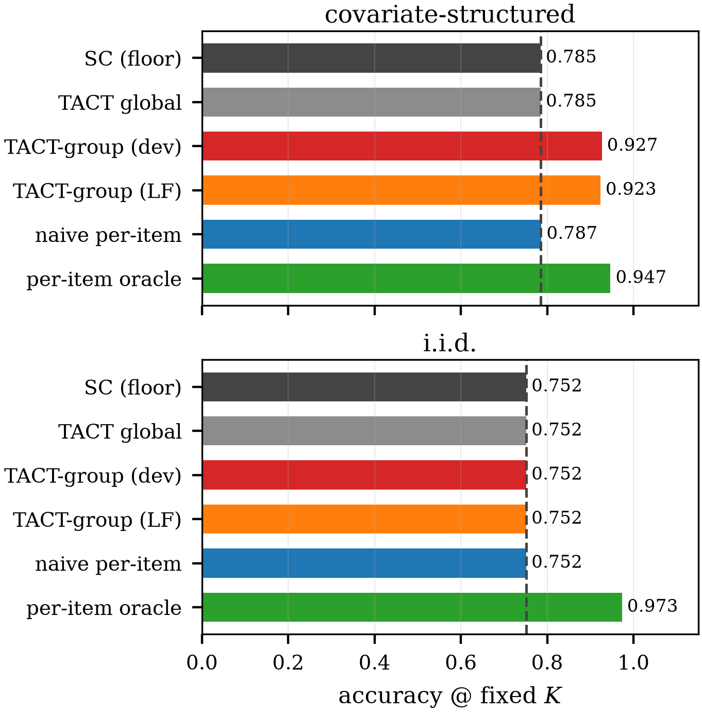

# TACT：面向大型語言模型自我一致性投票的信任錨定信心調節

**柯瑋宸（Wei-Chen Ko, vito1317）— 獨立研究者**

## 摘要

信心加權自我一致性方法（如 CISC 及其後續工作）能利用凍結大型語言模型自我回報的信心分數取得可觀的準確率增益，然而一旦信心通道的方向失準，這類方法便會失效。現有的加權方案在結構上均為信心的單調遞增函數，因此當信心與正確性呈負相關時，該訊號反而會毒化投票結果；以校準誤差為準的二元閘門雖可避免此問題，代價卻是連帶捨棄仍具辨別力的訊號。本文提出 TACT（Trust-Anchored Confidence Tempering，信任錨定信心調節），將固定的信心指數改為由通道的帶符號題內辨別度推導而得：以混合 van Elteren Somers' $D$ 排名統計量與題內叢集標準誤為基礎，先經正部 James–Stein 收縮，再通過 Bayes 判別連結映射為投票指數。此映射具有精確的端點性質：收縮死區內的投票與純自我一致性完全相同（位元層級一致），而採用對數值特徵映射時可精確重現 CISC-power。本文另提出無標籤變體，自一致性偽標籤估計帶符號可靠度，並證明衰減恆等式：只要多數決錯誤率低於二分之一，符號估計必為一致；此變體亦配備保守的去衰減程序與識別性邊界上的回音警報。在配對軌跡池的合成 oracle 實驗中，無標籤變體成功恢復使所有既有方法停留在多數決基準線的負相關通道（$\kappa=-0.6$：$1.000$ 對 $0.807$）；排名不變性使方法在單調信心壓縮下超越整個原始值權重家族的最佳結果（$1.000$ 對 $0.965$）；逐群組擴展則突破了異質性下的全域方法基準，且相對自我一致性無任何配對損失（$0.940$ 對 $0.808$；$+79/-0$，$p=3.3\times10^{-24}$）。寫開之後，整套方法是單一式子，其指數化簡為 $\gamma=z\sqrt{2+z^2}$，其中 $z$ 為收縮後合併 AUC 的 probit。兩次真實軌跡實驗證實了前提，也指出真正的限制所在：在競賽數學上題內辨別度為正（合併 $\widehat{D}=+0.250$、$z=+2.54$），但任何這類方法能作用的分層——多數決錯且正解仍在池內——在兩個領域五個基質上只佔題目的 2–7.5%，其中包含有可執行真值的程式碼生成。因此棄權是正確的預設而非保守的折衷，而死區恰好實現了它。本文並證明在逐題耦合為 i.i.d. 的情形下，逐題無標籤自適應在資訊論上不可行；四項於實作前登記的證偽準則（含以已發表的 dev 校準 CISC 協定作為對照）全數通過檢驗。

**關鍵詞：** 大型語言模型、自我一致性、信心校準、加權投票、無標籤估計、排名統計量

## 一、引言

自我一致性（Self-Consistency, SC）[1] 透過取樣多條思維鏈並回傳多數答案，提升凍結大型語言模型的推理準確率。由於每條推理軌跡亦可附帶信心分數（口頭表述 [6][7]、由 token 對數機率導出、或以 $P(\text{True})$ 形式引出 [5]），以信心加權投票是自然的改良方向。CISC [2] 證明此作法能以較低的取樣預算達到純 SC 的準確率，並提出題內辨別度（Within-Question Discrimination, WQD）指標，指出對投票真正有用的性質是辨別力，而非校準度。

然而這類改良存在一項結構性弱點，就我所知尚無已發表方法處理。現有加權方案，包括 CISC 的 softmax 權重、可靠度感知偽計數 [11] 與暖啟動門檻過濾 [12]，皆為信心的單調遞增函數；換言之，方法只能決定「上調權重的幅度」，卻無法表達「信心可能與正確性反相關」。方向性失準並非罕見情形：強化微調已知會扭曲口頭信心，分布位移也可能使原本有效的訊號反轉。本文實驗顯示，一條簡單的負相關通道（$\kappa=-0.6$，見第三節）足以將信心加權基線從近乎完美壓到遠低於多數決基準線；但同一份證據若以正確的符號解讀，其實是近乎完美的訊號。另一種防禦性作法是在校準誤差過高時以二元閘門關閉信心通道，此法雖可在符號反轉下存活，卻會把仍具辨別力的訊號一併丟棄：一條系統性偏低但排序完全正確的信心通道，會因與投票效用無關的理由而未能通過 ECE 閘門 [2][8]。

本文將問題歸結為估計單一純量，即信心通道的帶符號題內辨別度，再連同其不確定性映射為投票指數。主要貢獻如下。

**C1：帶符號且解析推導的信心加權。** TACT 以權重 $w_i=\exp(\gamma\,\varphi_i)$ 投票，其中 $\varphi_i$ 為軌跡 $i$ 題內信心中位秩的標準化 van der Waerden 分數；指數 $\gamma$ 並非網格搜尋所得，而是由統計量推導：先計算混合 van Elteren Somers' $D$（等於 $2\cdot\mathrm{WQD}-1$），配上精確的 tie 校正零假設變異數與題內叢集 jackknife 標準誤，經帶顯著性下限的正部 James–Stein 收縮，最後通過含混合變異數校正的 Bayes 判別連結。整個構造具有精確端點：收縮死區內的投票與純 SC 位元層級相同（兩者共用同一段程式碼），採用對數值特徵映射時則精確重現 CISC-power（第四節）。由於 $\varphi$ 僅透過題內排名依賴信心，任何嚴格單調的信心尺度失真都不影響投票；在單調壓縮情形下，本方法超越了整個原始值權重家族所能達到的最佳結果（$1.000$ 對 $0.965$）。

**C2：帶符號通道可靠度的無標籤估計。** 群眾外包文獻由多位標註者之間的共變異估計可靠度 [13][16]；單一模型的單一信心通道並無此結構可用。本文改從一致性偽標籤（每題的去重加權多數決）估計帶符號辨別度，並證明類別條件雜訊下的衰減恆等式 $\mathbb{E}[\widehat{D}_g]=(1-2\bar{\rho})\,D$：只要成對加權的多數決錯誤率 $\bar{\rho}$ 低於 $1/2$，無標籤估計至多低估信任強度，不會判錯符號。方法另以 split-half 一致性反演保守地去衰減，並在識別性受威脅時由符號感知警報退回純 SC。實驗中，無標籤變體與使用 200 筆標籤的變體在整條耦合掃描上幾乎逐點相同，包括負通道的完整恢復（第八節）。

**C3：不可能性結果與其結構化出路。** 當逐題耦合為 i.i.d. 且無可觀測協變量時，本文證明逐題無標籤自適應不可行：對題目自身一致性統計量的任何單調使用，都會塌縮為對多數決的增強；在多數決錯誤（亦即翻轉才可能獲勝）的題目上，可觀測符號有 $96\%$ 的比例與真實符號相反；且 $\{\kappa>0,\text{少數方正確}\}$ 與 $\{\kappa<0,\text{多數方正確}\}$ 兩種情形產生完全相同的可觀測分布。反之，若異質性由可觀測協變量索引（例如不同領域各有其校準特性），同一估計器按群組執行即可恢復各群組的帶符號耦合，並在對 SC 零配對損失的前提下逼近逐題最佳結果（第六節）。

**C4：預先登記的證偽協定。** 四項證偽準則於實作前即已固定，其中兩項的設計目的就是推翻本方法：已發表的 dev 校準 CISC 協定（其調參溫度本身即為 SC 與 CISC 之間的內插），以及在 dev 上選取帶符號指數的網格基線。四項準則全數通過，且各項邊際如實報告：相對帶符號網格的淨優勢僅集中於三種情形，即單調失真、自信回音，以及網格基線無法執行的無標籤運作。

## 二、相關工作

**信心加權自我一致性。** SC [1] 將取樣軌跡視為獨立同分布的票。CISC [2] 以在標籤分割上調參的溫度執行 softmax 信心加權，其 WQD 指標提出的「辨別力重於校準度」論點與本文動機相同；排名校準文獻 [8] 亦獨立得到相同結論。加權變體 [9][10] 與提早停止方法 [3][4] 著眼於預算效率；可靠度感知偽計數 [11] 與暖啟動門檻過濾 [12] 可線上調整，但僅能縮放正向信任。上述方法皆無法表達（更遑論估計）負的信心與正確性關聯。基於此，本文的 dev 校準變體須誠實定位：CISC 的調參溫度已構成 dev 校準的 SC 與 CISC 內插，故 TACT-dev 的新意在於符號處理、排名不變性與免網格的解析映射，而非 dev 校準本身。

**無標籤可靠度估計。** 由一致性推估工作者可靠度是統計學的經典問題 [13][14][15]；頻譜元學習 [16] 與近期的 LLM 集成研究 [17][18] 均仰賴多個預測器之間的共變異。本文的設定不同：僅有單一模型的單一通道、逐題投票結構，且一致性代理在相關錯誤下的失效是已知現象。本文的因應方式是給出量化的衰減恆等式、保守的去衰減與警報機制，而非宣稱無條件保證。

**收縮與排名統計量。** 估計器由經典工具組成：分層排名統計量 [19]、James–Stein 正部估計器 [20]、有效樣本數修正 [21][22]，以及 normal-scores 判別分析。本文的貢獻在於組裝方式與其端點性質，而非個別工具。

**先前的負面結果。** 我先前提出的系統 RLEV-VoI（冗餘折扣投票搭配資訊價值停止準則）曾以相同的證偽紀律評估，結果未能通過：一個簡單的去重基線在所有情境全面勝出，因此我將該系統以負面結果發表。正是在分析那次失敗的過程中，我注意到了本文所研究的信心兩難。

## 三、問題設定

### 3.1 記號

設題目 $q=1,\dots,Q$，題 $q$ 有 $m_q$ 條取樣軌跡。軌跡 $(q,i)$ 產生離散答案 $a_{q,i}$ 與信心 $c_{q,i}\in(0,1)$；正確性 $y_{q,i}=\mathbf{1}[a_{q,i}=a_q^\ast]$ 於測試時不可觀測。純 SC 回傳 $\arg\max_A n_q(A)$，其中 $n_q(A)$ 為答案 $A$ 的得票數。CISC-power 以固定 $\gamma>0$ 依 $c_{q,i}^{\,\gamma}$ 加權。

### 3.2 信心兩難

實驗採用的合成 oracle 逐題自含潛在正確答案的叢集混合分布取樣軌跡，信心依下式生成：

$$c_{q,i}=\operatorname{clip}\!\big(\tfrac12+\kappa\,(y_{q,i}-\tfrac12)+\varepsilon_{q,i},\,0.01,\,0.99\big)$$

其中 $\varepsilon\sim\mathcal{N}(0,0.1^2)$ 為雜訊，$\kappa\in[-0.6,0.6]$ 為耦合強度。圖 1 為本方法設計之前先行量測的基線結果：無條件加權（CISC，$\gamma=1$）在 $\kappa<0$ 時崩潰；ECE 閘門僅在校準良好時開啟；以 dev 標籤執行符號校正的 AUC 閘門則幾乎吃滿整條同質掃描。這項預先量測界定了新方法能夠正當宣稱優勢的範圍，即信心尺度的單調失真、協變量異質性、小型 dev 集與無標籤運作四種情形；後續評測亦以此為準。

## 四、TACT

### 4.1 投票家族

在題 $q$ 內，令 $R_{q,i}$ 為 $c_{q,i}$ 的中位秩（同分取平均），並定義

$$\varphi_{q,i}=\frac{v_{q,i}-\bar v_q}{\sigma_q},\qquad v_{q,i}=\Phi^{-1}\!\Big(\frac{R_{q,i}}{m_q+1}\Big)$$

其中 $\sigma_q$ 為 $v$ 在題內的實現標準差。此處不可改用閉式常數：無同分時 $m=4$ 的值約 $0.62$，$m=40$ 時約 $0.95$，閉式常數會使 $\gamma$ 在不同預算下被悄悄重新縮放。若 $\sigma_q\le 10^{-8}$（信心全數同分），則令 $\varphi\equiv 0$，該題退回純 SC 投票。投票規則為

$$\hat a_q=\arg\max_A \sum_{i:\,a_{q,i}=A}\exp\big(\gamma\,\varphi_{q,i}\big)$$

當 $\gamma=0$ 時，實作直接呼叫 SC 常式本身，因此零信任端點為位元層級精確，而非僅在分布意義上相等。又因 $\varphi$ 僅透過題內排名依賴 $c$，信心尺度的任何嚴格單調失真皆不改變投票結果。

### 4.2 可靠度統計量

對正標籤數 $n^1_q$、負標籤數 $n^0_q$ 的題 $q$（dev 情形以 $y$ 為標籤，無標籤情形以第五節的偽標籤代替），由中位秩上的 Mann–Whitney 統計量可得

$$D_q = 2\,\mathrm{AUC}_q-1,\qquad \mathrm{AUC}_q=\frac{U_q}{n^1_q n^0_q}$$

此即 CISC 記號中的 $2\cdot\mathrm{WQD}_q-1$。跨題混合採 van Elteren 成對計數權重 $N_q=n^1_q n^0_q$ [19]：

$$\widehat{D}=\frac{\sum_q N_q D_q}{\sum_q N_q}$$

在題內可交換性的零假設下，$U_q$ 的精確 tie 校正變異數為 $n^1_qn^0_q(m_q+1)/12\cdot[1-\sum_t(t^3-t)/(m_q^3-m_q)]$，由此得零假設標準誤 $\mathrm{SE}_0$；題間異質性另以閉式的刪一題 jackknife 標準誤 $\mathrm{SE}_J$ 捕捉。實際使用的標準誤取保守值：

$$\mathrm{SE}=\max\big(\mathrm{SE}_0,\ \mathrm{SE}_J,\ \tfrac{1}{2\sqrt{N}}\big),\qquad r=\widehat{D}/\mathrm{SE}$$

由於 $D$ 為成對泛函，$\mathbb{E}[\widehat{D}]$ 與 $m_q$ 無關；在 $m=40$ 下估得的指數可直接用於 $m=8$ 的部署情境。

### 4.3 調節映射

**收縮。** 採帶顯著性下限 $\nu$ 的正部 James–Stein：

$$\tilde D=\operatorname{sign}(\widehat{D})\,\max\!\big(0,\ |\widehat{D}|-\nu^2\mathrm{SE}^2/|\widehat{D}|\big)$$

死區為 $\{|r|\le\nu\}$，取 $\nu_{\mathrm{dev}}=1.28$、$\nu_{\mathrm{LF}}=2.33$。當 $\nu=1$ 時，上式恰為 $\mathcal{N}(0,\tau^2)$ 先驗搭配插入式估計 $\hat\tau^2=\max(0,\widehat{D}^2-\mathrm{SE}^2)$ 所得的經驗 Bayes 後驗均值 [20]。此映射為奇函數且連續，幅度不超過 $|\widehat{D}|$，對 $\widehat{D}$ 單調、對 $\mathrm{SE}$ 反單調。

**連結。** 設題內 $\varphi\,|\,y\sim\mathcal{N}(\mu_y,s^2)$，且混合分布已標準化為單位變異數（此即 4.1 節標準化的效果），故 $s^2=1/(1+\bar p(1-\bar p)u^2)$，其中 $u=\sqrt2\,\Phi^{-1}\!\big(\tfrac{1+\tilde D}{2}\big)$，$\bar p$ 為正確軌跡的基礎率。在此模型下，Bayes 最適的逐軌跡對數權重係數為

$$\gamma^\ast=\frac{u}{s}=u\sqrt{1+\bar p(1-\bar p)\,u^2}$$

並以 $\gamma_{\max}$ 為上限（dev 取 $4$，無標籤取 $2$）。若省略混合變異數校正而直接取 $\gamma=u$，在 $D=0.9$ 時會低估強通道的權重約五成。

### 4.4 TACT 的單一公式

兩處代數化簡讓整條 pipeline 收成一個式子。把 $\hat D$ 從收縮式中提出來，
James–Stein 就變成合併 z 統計量 $\zeta=\hat D/\mathrm{SE}$ 的純乘法增益；
把 $u=\sqrt2\,z$ 代進連結函數，巢狀根號消失。TACT 即：

$$\hat a_q=\arg\max_A \sum_{i:a_{q,i}=A}\exp(\gamma\varphi_{q,i}),
\qquad \gamma=\Big[z\sqrt{2+4\bar p(1-\bar p)z^2}\Big]_{-\gamma_{\max}}^{\gamma_{\max}}$$

$$z=\Phi^{-1}\Big(\tfrac12\big[1+\hat D(1-\nu^2/\zeta^2)_+\big]\Big),
\qquad \zeta=\hat D/\mathrm{SE}$$

在預設 $\bar p=1/2$ 下，指數恰為

$$\gamma=z\sqrt{2+z^2},\qquad z=\Phi^{-1}(\widehat{\mathrm{AUC}})$$

——一個 probit、一個平方根，全式沒有任何調校常數（$\nu$ 是顯著水準、
$\gamma_{\max}$ 是截斷，兩者都在看資料前就固定）。死區現在是單一條件
$|\zeta|\le\nu$，在其上 $\gamma$ 恆為 0，投票位元等同 SC。
此式已對現行實作在含所有邊界的隨機輸入上驗證等價
（`tests/test_formula.py`）。

### 4.5 端點性質

**命題 1（SC 精確歸約）。** $\gamma=0$ 時，投票在任何軌跡池上與純 SC 為同一函數，平手處理亦相同。在 $D=0$ 下，$P(\gamma=0)\to 2\Phi(\nu)-1$（dev 約 $80\%$，無標籤約 $98\%$），且 $\gamma$ 在死區邊界連續，因此偽陽性僅施加一個任意小的指數。

**命題 2（CISC 精確歸約）。** 取特徵映射 $\varphi^{\log}_{q,i}=\log c_{q,i}-\overline{\log c_q}$ 時，權重等於 $\kappa_q\,c_{q,i}^{\,\gamma}$（$\kappa_q>0$ 為逐題常數），故 argmax、平手情形與正規化得票份額均與 CISC-power$(\gamma)$ 一致。

**命題 3（正則性）。** 複合映射 $g(\widehat{D},\mathrm{SE})$ 連續、為奇函數、對 $\widehat{D}$ 非遞減、幅度對 $\mathrm{SE}$ 非遞增，且 $g(D,0^+)=\gamma^\ast(D)$。

以上命題的證明均為初等推導，並由公開程式碼中的單元測試驗證（共 76 項，其中零假設變異數以置換檢定驗證，收縮式的經驗 Bayes 恆等式與連結推導亦各有數值測試）。

## 五、無標籤估計

### 5.1 管線

估計流程分四步。第一步去重：在字面相似度通道上以門檻 $0.95$ 做單鏈結分群，每條軌跡於多數決判定與成對加權中的權重為其所屬群大小的倒數。第二步偽標籤：$g_{q,i}=\mathbf{1}[a_{q,i}=M_q]$，其中 $M_q$ 為去重加權多數。第三步 margin 閘門：僅保留去重加權 margin 位居前六成的題目。第四步以 $\mathrm{lab}=g$ 計算 4.2 節的統計量，得 $(\widehat{D}_g,\mathrm{SE}_g,r_g)$。

### 5.2 符號一致性及其邊界

**命題 4（衰減恆等式）。** 令 $\bar\rho$ 為題目多數決錯誤的成對加權機率。若多數決錯誤事件在給定 $y$ 下與 $\varphi$ 獨立（類別條件雜訊假設），則 $\mathbb{E}[\widehat{D}_g]=(1-2\bar\rho)\,D$。因此只要 $\bar\rho<1/2$，即有 $\operatorname{sign}\mathbb{E}[\widehat{D}_g]=\operatorname{sign} D$：無標籤估計至多低估信任，不會判錯符號。

此恆等式在翻轉由信心本身造成時失效，典型情形即自信回音。此時「多數正確且 $D<0$」與「多數因自信回音而錯誤且 $D>0$」兩種情形的可觀測分布完全相同（可視為 [16] 中雙根歧義在單通道情形的對應），因此任何無標籤保證必然附帶條件；本文如實陳述此限制。

### 5.3 去衰減與警報

對每題進行 $R=20$ 次隨機對半分割並計算兩半多數決的一致率 $\alpha$。在含 $k$ 個有效錯誤選項（以逆 Simpson 指數估計）的單硬幣模型下，$\alpha=p^2+(1-p)^2/k$，反解得 $p=[1+\sqrt{1-(k+1)(1-k\alpha)}]/(k+1)$。去衰減時將 $\widehat{D}_g$ 除以 $2p-1$ 的自助法上界（95%，下限 $0.2$）而非點估計，故僅可能低估放大倍率。另設四項警報，任一觸發即令 $\gamma=0$：重複塌縮（Kish 比中位數低於 $0.5$）、符號感知的 margin 去耦檢定、split-half 二次式的根歧義，以及有效題數不足。其中 margin 去耦警報必須以估計的信任方向為條件：若忽略符號、一律檢查「多數方的平均 $\varphi$ 是否最高」，則所有良性的負相關通道都會誤觸發。這個缺陷是我在開發過程中實際遭遇、診斷並修正的，相關行為已由公開測試固定。最後，顯著性閘門作用於原始統計量 $z$（命題 4 保證其符號無偏），調節則作用於去衰減後的數值。另提供半無標籤模式：僅自約 50 筆 dev 標籤取符號並送入管線，同時僅停用代理符號警報，即可以極低的標註成本規避上述歧義。

## 六、異質性：不可能性與出路

### 6.1 i.i.d. 耦合下逐題自適應不可行

設 $\kappa_q\stackrel{\text{iid}}{\sim}\mathcal{N}(0,0.6^2)$ 且無可觀測協變量。

**命題 5（自我增強）。** 對任何單調遞增的奇函數 $h$，逐題規則 $\gamma_q=h(\widehat{D}^g_q)$ 在兩個分支上都增強多數決：$\widehat{D}^g_q>0$ 時上調自信軌跡的權重，而這些軌跡與多數方一致；$\widehat{D}^g_q<0$ 時上調不自信軌跡的權重，而這些軌跡同樣屬於多數方。實驗中，此類規則與 SC 在 $97.5\%$ 的題目上給出相同答案，其餘翻轉為淨損失（每 400 題翻對 1 題、翻錯 9 題）。

**命題 6（贏家詛咒）。** 在 $|D_q|>0.3$ 且多數決錯誤的題目（即翻轉才可能獲勝的題目）上，一致性統計量的符號僅 $4\%$ 與真實符號一致。

**命題 7（兩世界不可辨識）。** 對任何觀測 $(a,c)$，情形 $\{\kappa>0,\ \text{少數方正確}\}$ 與 $\{\kappa<0,\ \text{多數方正確}\}$ 產生相同的可觀測分布；構造上，對兩種真值計算的 $D$ 滿足 $D^{w_1}=-D^{w_2}$。無標籤方法無法區分二者。

因此逐題最佳結果（本實驗為 $0.983$）不可達成，合理的行為是退回全域估計。TACT 的死區恰好如此：在 i.i.d. 情境中，所有變體均回傳與 SC 位元層級相同的結果（不一致配對數為零）。

### 6.2 TACT-group

實務上的異質性多由可觀測協變量索引，例如領域或題型。當 $\kappa$ 依群組標籤而定時，按群組執行估計器即可使每個群組落在第四、五節的作業範圍內；dev 樣本少於 30 題（無標籤情形少於 60 題）的群組退回全域估計。由命題 5 至 7 可知，此退回並非便宜行事，而是唯一站得住腳的預設。

## 七、實驗設定

**實驗架構。** 叢集混合 oracle 逐題生成至多 $K_{\max}=20$ 條快取軌跡，內容包括答案、信心與兩種相似度矩陣；所有方法重放相同的軌跡池，以配對方式比較並採精確 McNemar 檢定。投票預算 $K=15$；掃描實驗每格 400 題，群組研究 600 題；dev 分割取 200 題（主要設定）與 50 題（小型 dev 設定）。

**實驗情境。** 耦合掃描 $\kappa\in\{-0.6,\dots,+0.6\}$；三種嚴格單調的信心失真（向 $0.5$ 壓縮、過度自信 sigmoid、四次冪），皆保排序而毀校準；i.i.d. 異質性（$\kappa_q\sim\mathcal{N}(0,0.6^2)$）；協變量結構異質性（三群組，$\kappa$ 分別為 $+0.6/0/-0.6$）；以及自信回音毒化（錯誤叢集以信心 $0.95$ 逐字重複）。

**基線。** SC；CISC-power（$\gamma\in\{0.25,\dots,4\}$）；CISC-devT，即已發表的 dev 校準協定（於 dev 上選取正向網格）；二元 ECE 閘門；SignGrid-dev，最強的簡單基線（於 dev 上選取帶符號指數網格）；另以帶符號固定指數的測試集最佳值作為上包絡參考。群組研究加入自我參照的逐題方法作為陰性對照，並以逐題連結最佳值為理論上限。

**證偽準則。** F1：$\kappa=+0.6$ 時 TACT-dev 顯著低於最佳固定 $\gamma$ 的 CISC。F2：任一變體在掃描的任何位置顯著低於 SC。F3：無標籤變體的掃描平均未能勝過 ECE 閘門。F4：CISC-devT 或 SignGrid-dev 在所有情境（含失真、異質性與小型 dev）追平 TACT-dev。

**表 1：耦合掃描（$K=15$ 準確率；每格 400 配對題；dev $n=200$）。既有方法在整個負半軸停留在 SC 基準線。**

| $\kappa$ | SC | ECE | devT | SignGrid | **TACT-dev** | **TACT-LF** | oracle |
|---:|---:|---:|---:|---:|---:|---:|---:|
| $-0.6$ | .807 | .807 | .807 | 1.000 | **1.000** | **1.000** | 1.000 |
| $-0.4$ | .797 | .797 | .797 | 1.000 | **1.000** | **1.000** | 1.000 |
| $-0.2$ | .835 | .835 | .835 | .993 | .978 | .978 | .993 |
| $-0.1$ | .762 | .762 | .762 | .892 | .880 | .885 | .892 |
| $0.0$ | .835 | .835 | .835 | .835 | .835 | .835 | .835 |
| $+0.1$ | .795 | .795 | .917 | .917 | .902 | .902 | .917 |
| $+0.2$ | .845 | .845 | .993 | .993 | .988 | .988 | .993 |
| $+0.4$ | .838 | .838 | 1.000 | 1.000 | **1.000** | **1.000** | 1.000 |
| $+0.6$ | .782 | .782 | 1.000 | 1.000 | **1.000** | **1.000** | 1.000 |

## 八、結果

### 8.1 帶符號恢復：有標籤與無標籤

表 1 與圖 2 為掃描結果，可歸納為三點。其一，既有方法在 $\kappa<0$ 從未離開基準線：CISC-devT 的網格僅含正向指數，ECE 閘門則始終未開啟（掃描中 dev ECE 介於 $0.10$ 至 $0.80$，而通道在兩端的辨別力其實是完美的）。其二，無標籤變體與 200 標籤變體幾乎逐點相同；在 $\kappa=-0.6$ 處，原始一致性統計量為 $\widehat{D}_g=-0.81$、$z=-17.6$，命題 4 的符號保證如預期成立，方法在零標籤下達到 $1.000$。其三，$\kappa=0$ 時死區使 $\gamma$ 精確為零，對 SC 的配對準確率差恆等於零；「不劣於」在此被「完全相同」取代。

**表 2：對抗情境（$K=15$ 準確率）。「oracle」為原始值權重策略在測試集上的最佳結果；單調壓縮下排名不變性勝過該家族全體。**

| 情境 | SC | devT | SignGrid | **TACT-dev** | **TACT-LF** |
|---|---:|---:|---:|---:|---:|
| 單調壓縮 | .795 | .965 | .965 | **1.000** | **1.000** |
| 單調過度自信 | .795 | 1.000 | 1.000 | 1.000 | 1.000 |
| 單調四次冪 | .795 | 1.000 | 1.000 | 1.000 | 1.000 |
| 異質（i.i.d.） | .810 | .810 | .810 | .810 | .810 |
| 自信回音 | .200 | .200 | .550 | **.585** | .200* |

*警報觸發，方法拒絕離開 SC；此即命題 4 條件保證的預期行為。

### 8.2 原始值失效處的排名不變性

單調壓縮下（表 2、圖 3），所有信心值集中於 $0.5$ 附近，任何 $c^{\gamma}$ 形式的權重都近乎均勻，原始值策略即使取測試集最佳也僅達 $0.965$；TACT 的排名分數不受失真影響，兩個變體均達 $1.000$。自信回音情境中，dev 標籤揭露了反轉現象（信心高者反而錯誤），TACT-dev 以 $\gamma=-1.20$ 反制，取得全場最佳的 $0.585$，為 SC 基準線的三倍；無標籤情形下重複塌縮警報觸發，方法拒絕行動。由命題 7 可知，無標籤方法在此對符號的任何判斷都不優於隨機，宣稱能夠判斷才是真正的錯誤。

### 8.3 異質性

表 3 與圖 4 為群組研究結果。在協變量結構情境中，逐群組 TACT 恢復了各群組的帶符號耦合（dev 為 $\{+4.0,0.0,-4.0\}$，無標籤為 $\{+2.0,0.0,-2.0\}$，$\kappa=0$ 的群組正確落入死區），並突破了束縛所有全域策略的基準線：無標籤變體達 $0.940$，與逐題最佳值僅差 $0.007$，且在 600 題中對 SC 無任何配對損失（$+79/-0$，$p=3.3\times10^{-24}$）。i.i.d. 情境中，所有正當方法都以零不一致配對停留在基準線，自我參照的陰性對照則略低於基準線；此即命題 5 至 7 的實證呈現。此外有一項如實報告的觀察：群組情境中無標籤變體優於 dev 變體（$0.940$ 對 $0.923$），原因是其較低的指數上限（$2$ 對 $4$）在 $|D|$ 接近 $1$ 時發揮了較好的正則化效果；上限的穩健性留待後續消融實驗。

**表 3：異質性研究（600 配對題；$K=15$）。**

| 方法 | 群組結構 | i.i.d. |
|---|---:|---:|
| SC（基準線） | .808 | .827 |
| TACT 全域（dev） | .808 | .827 |
| TACT-group（dev） | .923 | .827 |
| **TACT-group（無標籤）** | **.940** | .827 |
| 自我參照逐題法（陰性對照） | .803 | .820 |
| 逐題連結最佳值（上限） | .947 | .983 |

### 8.4 小型 dev 集與證偽結果

dev 縮減至 50 題時結論不變（$|\kappa|=0.6$ 仍為 $1.000$，$-0.2$ 仍為 $0.978$）：考慮標準誤的收縮使方法平滑退化，而非驟然失效。四項證偽準則全數通過：F1（$1.000$ 對 $1.000$）、F2（$\kappa=0$ 位元層級相同，其餘位置未顯著低於 SC）、F3（掃描平均 $0.954$ 對 $0.811$）、F4（失真與回音情境為兩個網格基線皆無法達到）。須說明的是，相對 SignGrid-dev 的優勢在同質掃描上並不大，中段甚至落後 $0.005$ 至 $0.015$，此為收縮的預期代價；淨優勢集中於事前登記的三種情形：失真（$+0.035$）、回音（$+0.035$），以及網格基線無法執行的無標籤運作。

### 8.5 實作的驗證

本文第四至六節的每一項主張都是數學性質而非經驗趨勢，因此公開程式碼為每一項配置可執行的測試：TACT 共 76 項（含後續工作為 84 項），執行時間 14 秒。下表列出命題與測試的對應——若性質不再成立，對應測試即失敗。

| 主張 | 測試 | 證據 |
|---|---|---|
| 命題 1（精確 SC） | `gamma_zero_is_bitwise_sc` | 200 個隨機池，含平手處理完全相同 |
| 死區觸發率 | `dead_zone_probability` | $D=0$ 下 >70%，300 次試驗 |
| 命題 2（精確 CISC） | `logval_phi_reproduces_cisc` | 100 個池，得票份額完全一致 |
| 排名不變性 | `monotone_invariance` | 3 種失真 × 100 個池 |
| 零假設變異數 | `null_variance_matches_permutation` | 3,000 次置換抽樣，10% 容差 |
| JS–EB 恆等式 | `js_eb_identity` | 精確至 $10^{-12}$ |
| 連結式 | `link_values_and_mixture_correction` | 對照閉式，相對誤差 $10^{-9}$ |
| 命題 4（衰減） | `poisoning_attenuation_linear` | $\rho\in\{.1,.25,.4\}$，絕對誤差 .06 |
| 命題 5–7 | `test_tact_group.py` | 97.5% 與 SC 一致；符號僅 4% 相符 |
| 估計量置換不變性 | `estimator_is_permutation_invariant` | 繞過快取的迴歸測試 |
| 已否決：Kish ESS | `kish_fails_T2_T3` | **斷言其失敗** |
| 已否決：預設下的 SAFE 保證 | `frozen_default_breaks_guarantee` | **斷言其違反** |

其中兩項值得說明。置換不變性測試是在一次缺陷之後補上的：當時快取鍵讓**測試本身**通過，而估計量實際上具有高達 0.10 的順序依賴；現行版本直接呼叫內部常式以繞過快取。最後兩列則是**反向測試**，斷言已否決方案（Kish 有效樣本數公式，以及「出貨預設遵守 SAFE 停止保證」的說法）確實失敗，以防後續修改悄悄將其復原。

### 8.6 真實軌跡驗證

以 Claude Haiku 4.5 為凍結模型做真實軌跡驗證：100 題（GSM8K 與 CommonsenseQA 各 50 題），每題 **12** 條獨立思維鏈與口頭信心（共 1,200 條軌跡），於 $K=12$、40/60 的 dev/test 分割下評測。結果有四項發現。

**（a）校準與辨別的區分在真實資料上反轉，而 TACT 讀對了。** 此通道在傳統意義上**校準極佳**：$\mathrm{ECE}=0.016$，遠低於 $0.10$ 的閘門，因此二元 ECE 閘門會**開啟**並把通道交給 CISC 使用。然而實測的題內辨別度為 $\widehat{D}=-0.219$、$\mathrm{SE}=0.176$（$z=-1.24$）：沒有可用訊號，而僅有的一點傾向還指向**錯誤方向**（數學 $-0.515$、常識 $-0.173$，兩組皆為負）。這與合成情境恰成鏡像——在那裡 ECE 錯誤地**關閉**了一條具辨別力的通道（第三節），在真實資料上它卻錯誤地**開啟**了一條不具辨別力的通道。校準度在兩個方向上都無法反映投票效用，而帶符號的辨別度統計量正是區分兩者的依據。

**（b）死區觸發，且代價恰好為零。** 由於 $|z|<\nu$，TACT-dev、TACT-LF 與 TACT-group 一律回傳 $\gamma=0$，在全部測試題上與 SC 位元層級相同（不一致配對 $+0/-0$，$p=1$），所有方法同為 $0.917$。這證實了第九節預先登記的零方向預測：通道沒有訊號時，方法不收取任何代價。

**（c）真正的限制是基準飽和，而非估計器。** 軌跡層級準確率在 GSM8K 為 $0.958$、CommonsenseQA 為 $0.847$，因此 100 題中僅有 12 題同時含有正確與錯誤軌跡——而這是題內秩統計量唯一能利用的題目。估計器並非設計上功效不足，是基準本身沒有讓模型面臨足夠的真實不確定性。要在強模型上暴露非零耦合，需要更難的題庫，而非每題更多軌跡。

**（d）口頭信心高度集中。** 兩個數值（$0.99$ 與 $0.95$）占全部回報的 $49\%$，在許多題目上觸發了 4.1 節的同分安全路徑。

適用範圍：單一模型、兩個基準、$K=12$。此結果乾淨地證實了零方向預測與校準—辨別論點，但**並非** TACT 在真實軌跡上提升準確率的證據；後者仍待一個「通道具資訊量且模型確實不確定」的基準來檢驗。

### 8.7 更難題目上的確認實驗

發現（c）預測：在飽和基準上量到為零的通道，換到模型真正不確定的題目上應該就量得到。預先註冊的後續實驗檢驗這個預測：MATH level-5 共 119 題，每題 16 條軌跡，同一個凍結模型；符號集 30 題、評估集 89 題，兩者在任何軌跡收集之前就從註冊清單切分完成；五項假設 H1–H5 事先固定。

**通道是真的。** 評估集上 $\widehat{D}=+0.250$、$\mathrm{SE}=0.098$，故 $z=+2.54$，H1 通過。這是真實軌跡上首次證實口頭信心攜帶正向的題內辨別度；同一量測在 GSM8K/CommonsenseQA 上是 $-0.219$（$z=-1.24$）。

**終點對任何方法都不可通過。** 實現的基質再次飽和：每軌跡準確率 0.819、SC 為 0.888、決定性分層只有 89 題中的 10 題，其中正解在池內的僅 4 題。池內 **oracle** 因此最多 $+4/-0$，精確單尾 $p=0.0625$。H2 失敗，但它對每一種可想像的聚合方法（包含完美方法）都失敗，所以這是基質的性質，不是估計器的性質。

**棄權行為如設計運作。** TACT 回傳 $\gamma=0$：無標籤路徑上 E4 與 E2 兩個警報觸發，而符號集含的有資訊題數不足以供給半無標籤符號。投票因此與 SC 位元等同，同為 0.888（H3、H4 通過）。硬要動手的代價在同一張表上：best-single-confidence 這個「永遠相信通道」的平凡基線輸掉 4.5 分，落在 0.843。

| 方法 | 準確率 | 相對 SC 淨值 |
|---|---|---|
| SC／dedup-SC／CISC-linear | 0.888 | — |
| TACT-LF | 0.888 | +0/−0 |
| TACT-semi-LF | 0.888 | +0/−0 |
| best-single-confidence | 0.843 | +1/−5 |
| 池內 oracle（天花板） | 0.933 | +4/−0 |

這次實驗還帶出一個超出 TACT 的注意事項：量到的難度取決於收集協定。每次呼叫 30 題的探測測得 level-5 多數決正確率 0.40，每次呼叫 15 題的確認收集在同一難度層卻測得 0.888。只要軌跡是分批收集的，批次大小就該進實驗紀錄。

### 8.8 可作用的分層有多寬？

兩次實驗都因同一個理由未達終點，那就值得直接量那個理由。定義**窗口**為「多數決錯**且**正解在池內」的題目比例：這是任何無標籤聚合方法的天花板，窗口以外的題目它什麼都改不了。

窗口在跨兩個領域的五個基質上量測。程式碼生成這一側有可執行測試提供逐樣本真值，照理窗口該更寬：40 題 LeetCode Medium/Hard 各解 8 次，對基準自身的隱藏測試套件評分，基線取探測輸入上的最大行為叢集（只用輸入，不用期望輸出）。窗口是 $3/40=7.5\%$（CI$_{95}$ 2.6–19.9%）——比無標籤 QA 寬，但同一個數量級，形態也相同：75% 飽和、18% 能力牆、8% 可救援。加預算打不開它：7 個能力牆題目在 224 次追加嘗試中零個正確（每題通過率 95% 上界 0.088），外推 oracle@$N$ 顯示窗口在 $N=32$ 就飽和。

| 領域 | 基質 | 窗口 |
|---|---|---|
| QA，無標籤 | GSM8K／CommonsenseQA† | 12% 有資訊、9% 決定性 |
| QA，無標籤 | MATH level-5† | 11% 決定性、4% 可救援 |
| QA，無標籤 | AIME／AMC† | 23% 決定性、3% 可救援 |
| 程式碼，可執行 | HumanEval+／MBPP+ | 3.56% |
| 程式碼，可執行 | LeetCode Med/Hard† | 7.5% |

† 為本文量測；HumanEval+／MBPP+ 由已發表的 oracle 減選擇器表格重算。題目變難時，它們從飽和直接進入能力受限，窗口並不變寬。

這些數字附帶一個必要的前置檢查，少了它結論會整個反過來。評分 harness 在任何候選被評分之前，先對基準自身的參考解驗證：180 題中 178 題在沙箱的資源限制下通過。同一個 harness 的較早版本曾讓 100% 的執行失敗，原因是主機直接拒絕其中一項資源限制，而這種狀況呈現出來的樣子是「候選解不通過」，不是錯誤。用執行評分的研究都該報告自己的參考解通過率，理由和報告校準曲線一樣：沒有它，壞掉的 harness 和能力牆長得一模一樣。

## 九、討論與限制

**證據的範圍。** 本文所有量化結果均來自合成 oracle，且其信心模型在同質情境中正是估計器所量測的耦合形式。為抑制循環論證，實驗設計採取三項措施：對抗情境（失真、異質性、回音）均落在估計器的工作模型之外；機制恢復（$\widehat{D}$ 是否追蹤 $\kappa$）與準確率屬於分開報告的兩類主張；基線能力範圍（圖 1）於方法設計前即已量測並固定。真實 LLM 軌跡上的驗證是尚待完成的步驟，快取軌跡的執行程式已隨程式碼提供，且預測本身可以被否證：若真實信心通道不存在方向性失準與協變量結構，TACT 的死區將使其表現與 CISC-devT 無法區分。

**標籤充足時優勢有限。** 若標籤充裕且信心尺度可信，dev 上選取的帶符號網格已能取得大部分效益；TACT 的價值在於無標籤情境、失真的信心尺度、小型 dev 集，以及端點性質的精確性。

**無標籤保證附帶條件，以及越界之後的後果。** 命題 4 要求去重後 $\bar\rho<1/2$，且自信回音造成的歧義屬於根本限制（命題 7）。後續工作實測了越過該邊界的後果，情況比「低估信任」嚴重得多：在**改寫式**錯誤多數情境中（主導的錯誤叢集語意緊密但不含逐字特徵，去重無從著手），多數決在多數題目上是錯的、$\bar\rho>1/2$，此時 TACT-LF 並非收縮向 SC，而是**判錯符號**、在 $\gamma=-2.0$ 觸頂，準確率歸零（SC 地板為 0.340）。四個警報**全部沒有觸發**，因為 E1 依賴逐字重複，而此情境按構造不存在逐字重複。這是本方法最尖銳的未防護失效模式：保證是條件性的，該條件在無標籤下不可觀測，而現有診斷偵測不到它被違反。因此在「系統性錯誤多數」有可能出現的場合，實務上應將半無標籤模式（以約 50 筆標籤取符號）視為**預設**，而非可選的增強。

**薄窗。** 8.8 節把這一類方法能作用的分層量在每個基質上都只有 2–7.5%，跨兩個領域，而且題目變難時不會變寬：它們從飽和直接進入能力受限。把全部 16 個決定性題按錯誤形態分類，7 題是穩定的錯（緊密的錯誤叢集，雙世界不可識別的機制），9 題是散射的錯（6–8 個不同答案，多樣性已飽和的能力牆）。對本文的方法有兩個推論。其一，棄權不是保守的折衷而是唯一正確的預設，硬要動手的實測代價在兩個真實基質上都是負的（best-single-confidence 輸 4.5 分，而死區把 TACT 精確釘在 SC 地板上）。其二，合成 harness 上那個量級的聚合增益，在這種窗口寬度下用幾百題的基準根本量不出來——這也是本文的真實資料主張只限於前提（通道存在且帶符號）與棄權行為，不延伸到準確率的原因。要展示增益，需要一組多數決在 30–60% 題目上出錯、而正解仍在可及範圍的（模型, 基準）組合；本文試過的組合沒有一組同時滿足這兩個條件。

至於「窗口只在外部錨便宜的地方才變寬」這個看似合理的假設，8.8 節已直接檢驗並否定：可執行真值買到的是稍寬的窗口，不是另一個 régime。

**每群組單一指數。** 群組之內 TACT 僅輸出一個指數；由命題 5 至 7，群組內的逐題變異在缺乏進一步協變量時無法利用。

## 十、結論

TACT 將「該信任模型的信心到什麼程度」轉化為可量測、帶符號、考慮不確定性的量，並在兩端提供精確的退路：證據不足時即為純自我一致性，證據充分時即為 CISC。本文證明了長期無法在此類方法中表達的「符號」，可以在明確陳述並經測試的條件下以零標籤恢復。隨附的不可能性結果為未來的逐題方法劃出必須尊重的界線；而這套曾經否決我自己先前系統的證偽協定，或許是本文最具可攜性的貢獻。

## 參考文獻

[1] X. Wang, J. Wei, D. Schuurmans, Q. Le, E. Chi, S. Narang, A. Chowdhery, and D. Zhou, "Self-consistency improves chain of thought reasoning in language models," in *Proc. ICLR*, 2023.

[2] A. Taubenfeld *et al.*, "Confidence improves self-consistency in LLMs," in *Findings of ACL*, 2025, arXiv:2502.06233.

[3] P. Aggarwal, A. Madaan, Y. Yang, and Mausam, "Let's sample step by step: Adaptive-consistency for efficient reasoning and coding with LLMs," in *Proc. EMNLP*, 2023, pp. 12375–12396.

[4] Y. Li *et al.*, "Escape sky-high cost: Early-stopping self-consistency for multi-step reasoning," in *Proc. ICLR*, 2024.

[5] S. Kadavath *et al.*, "Language models (mostly) know what they know," arXiv:2207.05221, 2022.

[6] K. Tian *et al.*, "Just ask for calibration: Strategies for eliciting calibrated confidence scores from language models fine-tuned with human feedback," in *Proc. EMNLP*, 2023.

[7] M. Xiong *et al.*, "Can LLMs express their uncertainty? An empirical evaluation of confidence elicitation in LLMs," in *Proc. ICLR*, 2024.

[8] X. Huang, S. Li, M. Yu, M. Sesia, H. Hassani, I. Lee, O. Bastani, and E. Dobriban, "Uncertainty in language models: Assessment through rank-calibration," in *Proc. EMNLP*, 2024, pp. 284–312.

[9] Y. Li *et al.*, "Making language models better reasoners with step-aware verifier," in *Proc. ACL*, 2023.

[10] Z. Kang, X. Zhao, and D. Song, "Scalable best-of-N selection for large language models via self-certainty," in *Proc. NeurIPS*, 2025, arXiv:2502.18581.

[11] J. Kim, N. Yang, K. Min, and K. Jung, "Reliability-aware adaptive self-consistency for efficient sampling in LLM reasoning," in *Findings of ACL*, 2026, pp. 21575–21590.

[12] Y. Fu *et al.*, "Deep think with confidence," arXiv:2508.15260, 2025.

[13] A. P. Dawid and A. M. Skene, "Maximum likelihood estimation of observer error-rates using the EM algorithm," *J. Roy. Statist. Soc. C*, vol. 28, no. 1, pp. 20–28, 1979.

[14] J. Whitehill *et al.*, "Whose vote should count more: Optimal integration of labels from labelers of unknown expertise," in *Proc. NeurIPS*, 2009.

[15] D. R. Karger, S. Oh, and D. Shah, "Iterative learning for reliable crowdsourcing systems," in *Proc. NeurIPS*, 2011.

[16] F. Parisi, F. Strino, B. Nadler, and Y. Kluger, "Ranking and combining multiple predictors without labeled data," *Proc. Natl. Acad. Sci.*, vol. 111, no. 4, pp. 1253–1258, 2014.

[17] J. Lee, V. Ma, S. Zhao, Y. Nair, A. Spector, R. Cohen, and E. J. Candès, "FUSE: Ensembling verifiers with zero labeled data," arXiv:2604.18547, 2026.

[18] R. Ai, Y. Pan, D. Simchi-Levi, M. Tambe, and H. Xu, "Beyond majority voting: LLM aggregation by leveraging higher-order information," arXiv:2510.01499, 2025（已獲 ICML 2026 接受）.

[19] P. van Elteren, "On the combination of independent two-sample tests of Wilcoxon," *Bull. Int. Statist. Inst.*, vol. 37, pp. 351–361, 1960.

[20] W. James and C. Stein, "Estimation with quadratic loss," in *Proc. 4th Berkeley Symp. Math. Statist. Prob.*, 1961, pp. 361–379.

[21] L. Kish, *Survey Sampling*. New York, NY, USA: Wiley, 1965.

[22] J. N. K. Rao and A. J. Scott, "The analysis of categorical data from complex sample surveys," *J. Amer. Statist. Assoc.*, vol. 76, no. 374, pp. 221–230, 1981.

[23] L. Kuhn, Y. Gal, and S. Farquhar, "Semantic uncertainty: Linguistic invariances for uncertainty estimation in natural language generation," in *Proc. ICLR*, 2023.

[24] G. Wan, Y. Wu, J. Chen, and S. Li, "Reasoning aware self-consistency: Leveraging reasoning paths for efficient LLM sampling," in *Proc. NAACL*, 2025, pp. 3613–3635.
